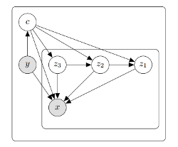

# Towards a neural statistician

This repo contains PyTorch implementation of the generative model proposed in [Towards a neural statistician (Edwards and Storkey, ICLR 2017)](https://arxiv.org/pdf/1606.02185.pdf). The implementation contains our replication of all experiments provided in the paper. It also has an extension that allows for generating datasets conditioned on some labels. 

## Synthetic data experiment

Train a model:

```
python train.py --experiment synthetic --lr 1e-3 --num_epochs 50 --context_dim 3
```

Test a model:

```
python test_synthetic.py --model_name path_to_your_model 
```

Test script will save mean contexts, distribution, means and variances for each sampled dataset as numpy array. 

Our visualisation of these numpy arrays:


The following image shows 3-D scatter plots of the summary statistics learned. Each point is the mean of the approximate posterior
over the context. Left plot shows points colored by distribution family, center plot colored by the mean and
right plot colored by the variance. The plots have been rotated to illustrative angles.

## Spatial MNIST experiment

Train a model:

```
python train.py 
```

Test a model:

```
python test_synthetic.py 
```

TODO: add results for this experiment

## Omniglot experiment

Train a model:

```
python train.py --experiment omniglot --nll bernoulli --num_data_per_dataset 5 --num_epochs 400 \
--context_dim 512 --masked --z_dim 16 --h_dim 4096 --batch_size 32 --lr 0.0001 --tensorboard
```

To sample from trained model, conditioned on unseen OMNIGLOT classes:

```
python test_omniglot.py --experiment omniglot --num_data_per_dataset 5 --num_samples_per_dataset 5 \
--context_dim 512 --masked --z_dim 16 --h_dim 4096 --batch_size 16 --model_name your_model_name
```

Our samples from trained model for unseen omniglot classes:


Few-shot learning to OMNIGLOT unseen classes. Left rows are input sets, right rows are samples given the inputs. The results were not cherry-picked. 

To sample from trained model, conditioned on MNIST:

```
python test_omniglot.py --experiment omniglot --num_data_per_dataset 5 --num_samples_per_dataset 5 \
--context_dim 512 --masked --z_dim 16 --h_dim 4096 --batch_size 16 --model_name your_model_name --test_mnist
```

Our samples from trained model for unseen omniglot classes:


Few-shot learning from OMNIGLOT to MNIST. Left rows are input sets, right rows are samples given the inputs. The results were not cherry-picked. 

To get classification accuracy for a few-shot learning task with M classes using K samples per class:

```
python test_omniglot_accuracy.py --experiment omniglot --num_data_per_dataset K --num_classes M \
--context_dim 512 --masked --z_dim 16 --h_dim 4096 --batch_size 20 \
--model_name your_model_name
```

To get results on MNIST dataset include **--test_mnist** option.

<!-- .element height="50%" width="50%" -->

Table comparing comapring results obtained with our implementation and the ones provided in the paper. 

## YouTube Faces

Train a model:

```
python train.py 
```

Test a model:

```
python test_synthetic.py 
```

TODO: add results for this experiment

## Extension

For conditioning on the label, we slightly changed the proposed graphical model
by introducing observed variable y:

<!-- .element height="50%" width="50%" -->

The code can be find in **movements** branch of our repo. 

Train a model:

```
python train.py --data_dir=emotions_resized/ --z_dim=16 --context_dim=500 \
--h_dim=4096 --num_epochs=5000 --num_data_per_dataset=6 --experiment=youtube --x_dim=4096 \
--n_channels=1 --total_num_persons=123 --train_num_persons=113 --test_num_persons=5 \
--use_labels --num_labels 8 --tensorboard
```

Sample from a trained model:

```
python test_youtube.py --data_dir=emotions_resized/ --z_dim=16 --context_dim=500 \
--h_dim=4096 --num_data_per_dataset=6 --experiment=youtube --x_dim=4096 \
--n_channels=1 --total_num_persons=123 --train_num_persons=113 --test_num_persons=5 \
--use_labels --num_labels 8 --model_name your_model_name
```

To train our model we used [CK+ emotions database](http://www.consortium.ri.cmu.edu/ckagree/). 

Sample faces conditioned on emotion label:


